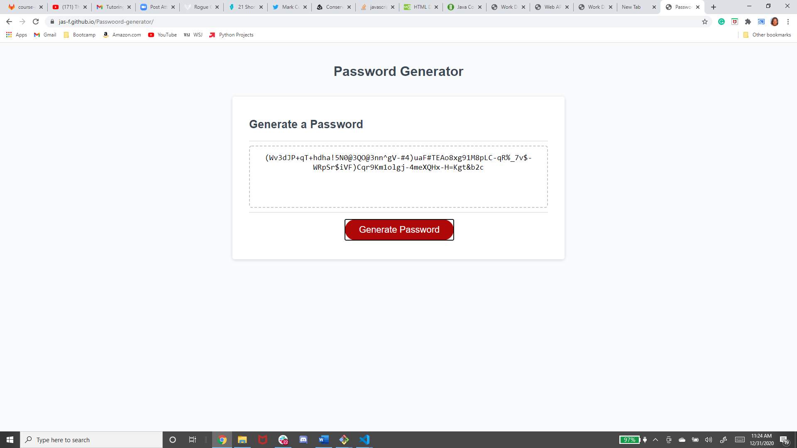

# Updated Portfolio
<br>
===========


<br>

## Pin 2 Projects

```
<div class= 'row'>
            <div class= 'col-4'>
                <h2>Password Generator</h2>
                <a href='https://jas-f.github.io/Passwoord-generator/'>Deployed Link</a>
                <a href='https://github.com/Jas-F/Passwoord-generator'>GitHub Repo</a>
            </div>

            <div class= 'col-8'>
                <div class='card' style='width: 25rem;'>
                    
                </div>
            </div>       
        </div>

```
<br>

## Downloadable Resume PDF

```
saveBtn.on('click', function (){
let inputValue=$(this).siblings('.description').val()
let id=$(this).parent().attr('id')
localStorage.setItem(id,inputValue)
});

$('#9 .description').val(localStorage.getItem('9'))
```
<br>

## Mobile Responsive

```
/* For desktop: */
col-1 {width: 8.33%;}
col-2 {width: 16.66%;}
col-3 {width: 25%;}
col-4 {width: 33.33%;}
col-5 {width: 41.66%;}
col-6 {width: 50%;}
col-7 {width: 58.33%;}
col-8 {width: 66.66%;}
col-9 {width: 75%;}
col-10 {width: 83.33%;}
col-11 {width: 91.66%;}
col-12 {width: 100%;}

@media only screen and (max-width: 768px) {
  /* For mobile phones: */
  [class="col-sm-8"] {
    width: 100%;
  }
}
```

<br>

## Built With

* [HTML](https://developer.mozilla.org/en-US/docs/Web/HTML)
* [CSS](https://developer.mozilla.org/en-US/docs/Web/CSS)
* [Javascript](https://developer.mozilla.org/en-US/docs/Web/JavaScript)
* [Bootstrap](https://getbootstrap.com/)
* [Jquery]

## Deployed Link

* [See Live Site](https://jas-f.github.io/updated-portfolio/)

## License

This project is licensed under the MIT License 

See also the list of [contributors](https://github.com/your/project/contributors) who participated in this project.

## Prerequisites

Git hub,
Git lab,
Git bash,
Visual studio,
Google chrome,
Bootstrap,
JavaScript,
JQuery

## Authors

**Jasmine Franklin C: 301-332-2313 E: jasminer.franklin@gmail** 

- [Link to Portfolio Site](https://jas-f.github.io/responsive-portfolio/)
- [Link to Github](https://github.com/)
- [Link to LinkedIn](https://www.linkedin.com/in/jasmine-franklin-8b08ba121)

<p>&copy; UC Berkeley Extension Bootcamp.</p>
